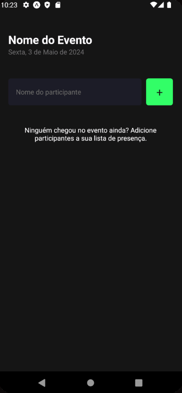
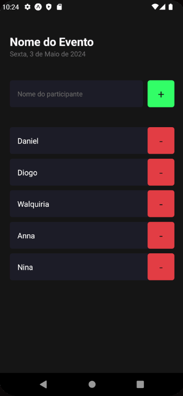

<h1 align="center"> Guest List </h1>

  <a href="#-tecnologias">Tecnologias</a>&nbsp;&nbsp;&nbsp;|&nbsp;&nbsp;&nbsp;
  <a href="#-projeto">Projeto</a>&nbsp;&nbsp;&nbsp;|&nbsp;&nbsp;&nbsp;

 

  
  

## 🚀 Tecnologias

Esse projeto foi desenvolvido com as seguintes tecnologias:

- React Native
- JavaScript
- TypeScript
- Git e Github
- Figma

## 💻 Projeto

A Guest List é uma lista de convidados de um evento, onde você pode adicionar ou remover convidados.

Feito com ♥ by Rocketseat & Dani :wave: 
